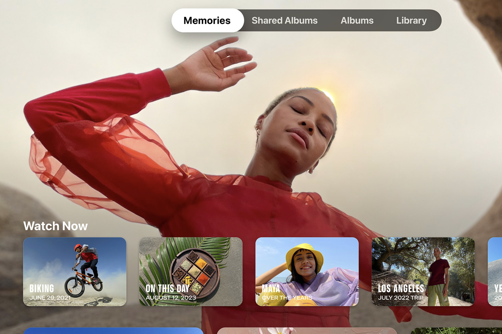
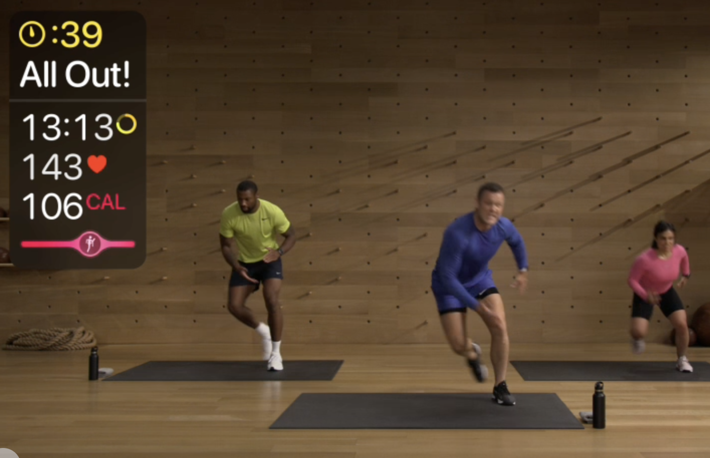
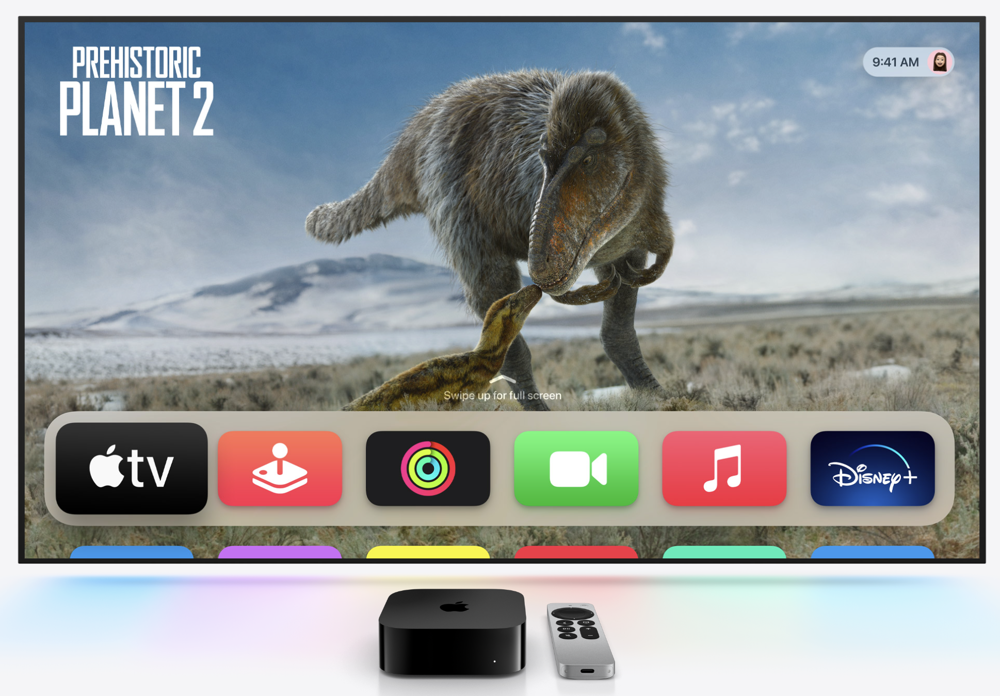
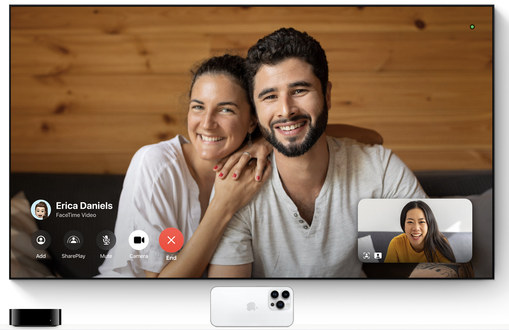
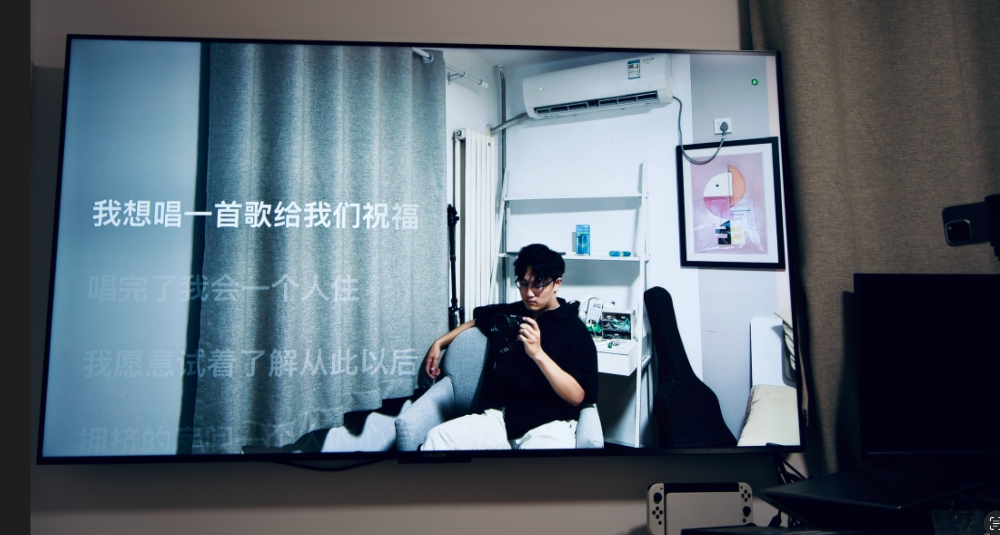

# 数码设备分享📷
平常刷各种数码测评是我幸福感的一大来源，作为资深云玩家/设备党，在这里分享一些高性价比数码产品的介绍和自己的使用感受～未来可能考虑会单独开辟一个相机以及镜头购买指南专栏。
## 我持有的数码设备
- 笔记本电脑：MacBook pro 14英寸 2021款，RTX3060游戏本
- 游戏主机：Switch OLED 日版
- 家庭服务器：装了Ubuntu 22.04 LTS的旧笔记本（未来会考虑换成低功耗的小主机/树莓派/NAS/Mac Mini)
- 工作主机：联想刃7000k，13700KF+4070Ti super
- 机顶盒/智能家居中枢：Apple tv 7代 
- 电视：雷鸟 鹤7-24款 65英寸
- 路由器：小米 ax3000t
- 相机：索尼$\alpha7m3$
- 镜头：腾龙28-200，索尼35 f1.8，唯卓仕85 f1.8
- 机头枪麦：索尼ECM-b10
- 手机：iPhone 15 pro

## 选购理由&使用体验
### 电视
雷鸟 鹤7 24款

- Mini LED电视，960分区背光
- 支持HDR10+/杜比视界等规格
- 无开机广告
- 有2个HDMI2.1接口，2个HDMI2.0接口

选择这一款电视的原因是，我希望可以看更多HDR片源的视频，平时用手机直接拍摄的视频也是HDR格式的。而现在的主流技术下，只有MiniLED背光和OLED电视可以比较好地支持HDR播放，OLED电视太贵了且峰值亮度比较低，不适合白天开窗看。今年国产厂家把Mini LED卷到了白菜价，我选了相对性价比更高的雷鸟，目前非常满意。
### 机顶盒
Apple tv 7代 Ethernet版

- 支持杜比视界与HDR10+规格的视频解码播放
- A15处理器（能买到的最便宜的A15设备）
- 干净流畅的tv os系统

在播放高规格视频的时候需要高性能的处理器，atv虽然便宜但还是配备了a15芯片，这个配置可以再用很多年。在苹果的生态里，各个设备联动做的很流畅，我可以在手机上预览和控制电视，可以高码率隔空投送。

可以在大屏幕的电视上看自己的手机相册。

{width=500px}

可以用跟着fitness+上的教练健身，并配合Apple watch监测健身数据。

{width=500px}

可以使用漂亮的系统，配合infuse可以看nas里的视频，可以在Netflix/Disney/tv+上看海量的高质量网剧

{width=500px}

可以配合iphone在大屏幕上和家人打清晰的FaceTime

{width=500px}

可以用Apple music k歌并沉迷自己的美妙的歌声和美妙的长相（bushi

{width=500px}

### 相机
待更新中...

