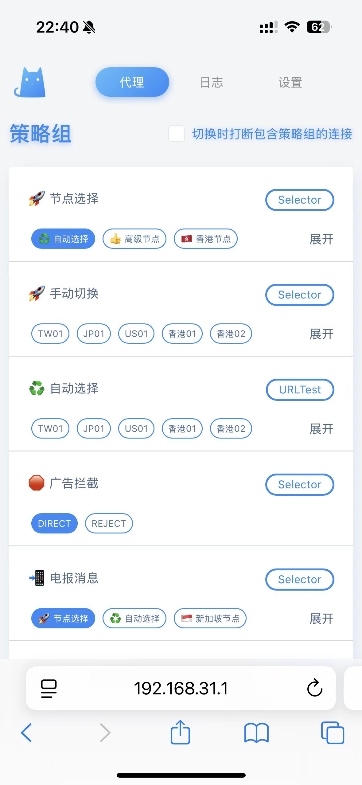

# 幸福树屋笔记📒
## 引言
毕业后入住出租屋已经很久了，逐渐把家里打造成了自己理想的样子，每天回到家里都觉得很幸福。在这里记录一下搭建的全过程，主要包括设备选择、网络环境搭建、智能家居系统搭建、Apple tv系统使用几部分。

## 设备选择
需求：

- 方便且流畅地观看高码率视频（支持HDR/杜比视界等规格）
- 方便且无感地使用国外流媒体平台（Youtube/Netflix等）
- 舒适地在大屏幕上体验主机游戏（Switch/PS5等）

设备：

- 机顶盒：Apple tv 7代
- 电视：雷鸟 鹤7-24款 65英寸
- 路由器：小米 ax3000t

# 网络环境搭建🕸️
## 前言
代理的方式有许多种，我选择以软路由的方式实现，好处是只要家里的设备接入了Wi-Fi，无需额外的操作就可以直接接入外网，这为使用许多不方便安装代理软件的设备提供了便利（例如switch、开发板等）。

软路由就是可以重新刷写固件实现特定需求的设备（区别于无法刷写固件的硬路由）。软路由可以是一个路由器，可以是一个迷你小主机，也可以是一个开发板。我的需求比较简单，只用对家庭网络实现规则代理，因此也选择了最简单的方式，直接在路由器上实现代理服务。

路由器选择的型号是小米ax3000t，理由是价格低廉性能够用，最重要的是出货量大，在互联网上可以找到大量的刷机教程，小白友好。

常见的软路由系统有Openwrt/梅林等，但我用不到开源软路由系统中的复杂功能与插件，因此选择了直接通过ssh在小米原生路由器系统里安装Shell clash插件。

这里参考了以下教程：

<https://www.youtube.com/watch?v=NfQ-ELR-TD8>

<https://www.youtube.com/watch?v=noBqKNq2MTk>

## 安装步骤
### 解锁SSH
#### Windows搜索cmd，以管理员身份运行：

    curl -X POST http://192.168.31.1/cgi-bin/luci/;stok=XXXXXX/api/misystem/arn_switch -d "open=1&model=1&level=%0Anvram%20set%20ssh_en%3D1%0A"
    curl -X POST http://192.168.31.1/cgi-bin/luci/;stok=XXXXXX/api/misystem/arn_switch -d "open=1&model=1&level=%0Anvram%20commit%0A"
    curl -X POST http://192.168.31.1/cgi-bin/luci/;stok=XXXXXX/api/misystem/arn_switch -d "open=1&model=1&level=%0Ased%20-i%20's%2Fchannel%3D.*%2Fchannel%3D%22debug%22%2Fg'%20%2Fetc%2Finit.d%2Fdropbear%0A"
    curl -X POST http://192.168.31.1/cgi-bin/luci/;stok=XXXXXX/api/misystem/arn_switch -d "open=1&model=1&level=%0A%2Fetc%2Finit.d%2Fdropbear%20start%0A"

#### 计算SSH密码
https://miwifi.dev/ssh 输入路由器的SN码，在路由器后台可以查询SN码。

用putty软件登录路由器，<a href="https://github.com/uyez/AX3000T/releases/download/rom/AX3000T.zip" target="_blank">点击下载>></a>

用户名是：root，密码是上一步计算出来的，提示 Are U OK 表示已经登录成功。

#### 永久开启SSH（重启不会关闭）

    mkdir /data/auto_ssh && cd /data/auto_ssh
    curl -O https://fastly.jsdelivr.net/gh/lemoeo/AX6S@main/auto_ssh.sh
    chmod +x auto_ssh.sh

    uci set firewall.auto_ssh=include
    uci set firewall.auto_ssh.type='script'
    uci set firewall.auto_ssh.path='/data/auto_ssh/auto_ssh.sh'
    uci set firewall.auto_ssh.enabled='1'
    uci commit firewall

### 安装ShellClash（ShellClash）：
ShellClash安装源：

    export url='https://fastly.jsdelivr.net/gh/juewuy/ShellCrash@master' && sh -c "$(curl -kfsSl $url/install.sh)" && source /etc/profile &> /dev/null

备用安装源：

    export url='https://gh.jwsc.eu.org/master' && sh -c "$(curl -kfsSl $url/install.sh)" && source /etc/profile &> /dev/null

 
Clash管理后台：http://192.168.31.1:9999/ui
在同一个局域网下，可以在浏览器中输入这个管理地址，方便地更改代理配置。

{width=200px}
